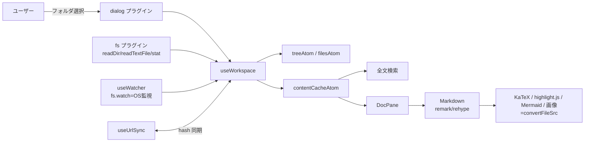

# ✨ mdglow

ローカルの Markdown フォルダを美しく読むための **デスクトップアプリ**（Tauri）。
数式・コード・図・全文検索・リアルタイム反映に対応し、ファイルは常に端末内で完結します。

> Web（File System Access API）版は `main` ブランチにあります。この `tauri` ブランチは
> ネイティブアプリ版で、**許可プロンプトなし・OS ネイティブ監視・本物の絶対パス**が使えます。

---

## 特徴

- **ネイティブ FS アクセス** — OS のフォルダ選択で開く。ブラウザの許可プロンプトは一切なし
- **リアルタイム反映** — OS ネイティブの file watcher で変更を即描画
- **リッチな描画** — GFM / 数式(KaTeX) / コードハイライト / Mermaid 図 / 相対画像・リンク解決 / フロントマター
- **エディタ機能** — ファイルツリー（D&D・右クリックで相対/絶対パスコピー）、全文検索(`⌘⇧F`)、クイックオープン(`⌘P`)、目次スクロールスパイ
- **画面分割** — VSCode 型ツリーグリッド（縦横混在・最大 6 ペイン）。ドラッグでサイズ調整、D&D 5 ゾーン配置、フォルダ単位で永続化
- **複数フォルダ登録** — 履歴保持・素早く切替。ツリー開閉状態も永続化
- **12 テーマ / 6 書体**（Anthropic Serif 含む）・本文幅切替
- **UI 崩れ対策** — 固定グリッド。長い表・コード・数式は各領域内でスクロール

## 動作要件

- macOS / Windows / Linux（システム WebView を使用）
- 開発時: Node.js + Rust ツールチェーン（`rustc` / `cargo`）

## 開発・実行

```bash
npm install
npm run tauri:dev      # Vite(5273) + ネイティブウィンドウを起動
```

初回はフォルダ選択ダイアログから Markdown フォルダを開く（同梱の `sample/` で試せる）。

## ローカルにインストール（アプリとして常用する）

### 前提: Rust ツールチェーン（未導入の場合）

```bash
# rustup 経由で Rust を導入（既に rustc/cargo があれば不要）
curl --proto '=https' --tlsv1.2 -sSf https://sh.rustup.rs | sh
# macOS はビルドに Xcode Command Line Tools が必要
xcode-select --install   # 未導入なら
```

### ビルドしてインストール

```bash
npm install
npm run tauri:build
```

生成物（macOS）:

- アプリ本体: `src-tauri/target/release/bundle/macos/mdglow.app`
- インストーラ: `src-tauri/target/release/bundle/dmg/mdglow_0.1.0_aarch64.dmg`

インストール:

```bash
# .app を Applications にコピー（= インストール）
cp -R "src-tauri/target/release/bundle/macos/mdglow.app" /Applications/
# 以降は Launchpad / Spotlight から "mdglow" で起動
open -a mdglow
```

- **署名について**: 未署名のため初回は Gatekeeper に止められることがある。その場合は
  「システム設定 → プライバシーとセキュリティ」で許可するか、`xattr -dr com.apple.quarantine /Applications/mdglow.app` を実行。
- **Windows**: `src-tauri/target/release/bundle/` に `.msi` / `.exe`（NSIS）。
- **Linux**: 同ディレクトリに `.deb` / `.AppImage`。

> 注意: `npm run tauri:build` は初回、release プロファイルの Rust コンパイルに数分かかります。

### 開発中のみ試す（インストール不要）

```bash
npm run tauri:dev      # 一時ウィンドウで起動（ビルド生成物は作らない）
```

## ショートカット

| 操作 | キー |
|------|------|
| クイックオープン | `⌘P` |
| 全文検索 | `⌘⇧F` |
| サイドバー切替 | `⌘B` |
| 右に分割 | `⌘\` |
| 閉じる | `Esc` |

---

## 設計

### アーキテクチャ

React 製フロントエンド（webview）＋ Tauri（Rust）バックエンド。ファイル I/O は Tauri プラグイン
（`fs` / `dialog`）に委譲し、フロントの状態は Jotai、描画は remark/rehype パイプラインで行う。



### FS 抽象（Tauri 置換ポイント）

Web 版との差分はこの層に集約されている：

| 役割 | 実装 |
|------|------|
| フォルダ選択 | `dialog.open({ directory: true })` → 絶対パス |
| ツリー走査 | `fs.readDir` を再帰 |
| ファイル読込 | `fs.readTextFile` / `fs.stat`（mtime） |
| 監視 | `fs.watch`（recursive, デバウンス 250ms） |
| 画像表示 | `convertFileSrc`（`asset://` URL） |
| 履歴保存 | idb-keyval に絶対パスを保存 |

パスは「ルートからの相対パス（表示・URL 用）」と「絶対パス（FS I/O 用）」を `TreeNode` に併記。

### 状態モデル（`src/state/atoms.ts`）

- `foldersAtom` / `activeFolderIdAtom` — 登録フォルダ（履歴・id=絶対パス）
- `treeAtom` / `filesAtom` — ツリーと平坦化ファイル一覧
- `contentCacheAtom` — 全 md の生テキスト（表示と全文検索で共有）
- `layoutAtom` / `activePaneIdAtom` — 分割レイアウトの二分木と選択中ペイン
- `savedLayoutsAtom` — フォルダごとの分割レイアウト永続化（`getOnInit: true`）
- `themeAtom` / `fontAtom` / `readingWidthAtom` / `expandedByFolderAtom` — 表示設定（永続化）

### 主要な設計判断

- **描画の安定化**: `Markdown` を `body` でメモ化し、スクロール等の親再レンダーで再パースしない。
- **Mermaid**: 実フォントで初期化＋`suppressErrorRendering`＋測定用一時ノードの除去で、編集途中の巨大 SVG・スクロール不能・チラつきを防止。
- **画像**: `convertFileSrc` で同期解決（blob 生成・revoke 不要）。
- **UI 崩れ防止**: 表はセル改行させず幅超過時はテーブルごと横スクロール（スクロールバー非表示）。コード/数式/図も内部スクロール。
- **権限**: capabilities で fs スコープを `$HOME/**`、assetProtocol スコープも同様に許可。

### ディレクトリ構成

```
src/
  state/atoms.ts        # Jotai atom（状態のソース）
  lib/                  # FS(Tauri)・検索・テーマ・フォント・URL・DnD・レイアウト操作
  hooks/                # useWorkspace / useWatcher / useUrlSync / useHotkeys / …
  components/           # UI（Toolbar/Sidebar/FileTree/PaneGroup/DocPane/Markdown/…）
src-tauri/              # Tauri(Rust)。lib.rs でプラグイン登録、capabilities/ で権限
```

## 既知の制約

- fs スコープ既定は `$HOME/**`。ホーム外（例: `/Volumes`）を開くには `src-tauri/capabilities/default.json` にスコープ追加が必要。
- 分割レイアウトはフォルダ単位で localStorage 保存（端末間共有はしない）。

## 技術スタック

Tauri 2 / Vite + React + TypeScript / Tailwind CSS v4 / Jotai / react-markdown（remark・rehype）/ KaTeX / highlight.js / Mermaid / Material Symbols
