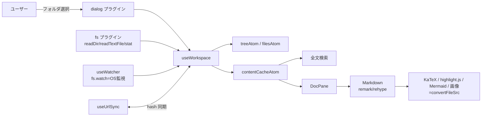

# ✨ mdglow

<p>
  
  
  
  
  
  
  
  
</p>

ローカルの Markdown フォルダを美しく読むための **デスクトップアプリ**（Tauri）。
数式・コード・図・全文検索・リアルタイム反映に対応し、ファイルは常に端末内で完結します。

> Web（File System Access API）版は `web` ブランチにあります。この `main` ブランチは
> ネイティブアプリ版で、**許可プロンプトなし・OS ネイティブ監視・本物の絶対パス**が使えます。

---

## 特徴

- **ネイティブ FS アクセス** — OS のフォルダ選択で開く。ブラウザの許可プロンプトは一切なし
- **リアルタイム反映** — OS ネイティブの file watcher で変更を即描画
- **リッチな描画** — GFM / 数式(KaTeX) / コードハイライト / Mermaid 図 / 相対画像・リンク解決 / フロントマター
- **エディタ機能** — ファイルツリー（D&D・右クリックで相対/絶対パスコピー）、全文検索(`⌘⇧F`)、クイックオープン(`⌘P`)、目次スクロールスパイ
- **画面分割** — VSCode 型ツリーグリッド（縦横混在・最大 6 ペイン）。ドラッグでサイズ調整、D&D 5 ゾーン配置、フォルダ単位で永続化
- **複数フォルダ登録** — 履歴保持・素早く切替。ツリー開閉状態も永続化
- **レビュー** — 本文を選んで指摘を残し、AI が CLI から読んで直して返信する。解決にするのは人間だけ
- **12 テーマ / 6 書体**（Anthropic Serif 含む）・本文幅切替
- **UI 崩れ対策** — 固定グリッド。長い表・コード・数式は各領域内でスクロール

> リリース（タグ push → 各OSビルド → GitHub Releases 配布 → 自動更新）の手順は
> [`RELEASING.md`](./RELEASING.md) を参照。

## 動作要件

- macOS / Windows / Linux（システム WebView を使用）
- 開発時: Node.js + Rust ツールチェーン（`rustc` / `cargo`）

## 開発・実行

```bash
npm install
npm run tauri:dev      # Vite(5273) + ネイティブウィンドウを起動
```

初回はフォルダ選択ダイアログから Markdown フォルダを開く（同梱の `sample/` で試せる）。

## ローカルにインストール（アプリとして常用する）

### 前提: Rust ツールチェーン（未導入の場合）

```bash
# rustup 経由で Rust を導入（既に rustc/cargo があれば不要）
curl --proto '=https' --tlsv1.2 -sSf https://sh.rustup.rs | sh
# macOS はビルドに Xcode Command Line Tools が必要
xcode-select --install   # 未導入なら
```

### ビルドしてインストール

```bash
npm install
npm run tauri:build
```

生成物（macOS）:

- アプリ本体: `src-tauri/target/release/bundle/macos/mdglow.app`
- インストーラ: `src-tauri/target/release/bundle/dmg/mdglow_0.1.0_aarch64.dmg`

インストール:

```bash
# .app を Applications にコピー（= インストール）
cp -R "src-tauri/target/release/bundle/macos/mdglow.app" /Applications/
# 以降は Launchpad / Spotlight から "mdglow" で起動
open -a mdglow
```

- **署名について**: 未署名のため初回は Gatekeeper に止められることがある。その場合は
  「システム設定 → プライバシーとセキュリティ」で許可するか、`xattr -dr com.apple.quarantine /Applications/mdglow.app` を実行。
- **Windows**: `src-tauri/target/release/bundle/` に `.msi` / `.exe`（NSIS）。
- **Linux**: 同ディレクトリに `.deb` / `.AppImage`。

> 注意: `npm run tauri:build` は初回、release プロファイルの Rust コンパイルに数分かかります。

### CLI にパスを通す

GUI と同じ実行ファイルが CLI も兼ねる。第 1 引数が `review` のときだけ、Tauri を
初期化せずコマンドとして動く。レビュー機能をエージェントから使えるように、実行ファイルへの
シンボリックリンクを PATH の通ったところに張る。

```bash
# ~/.local/bin に置く（sudo 不要。PATH に無ければ .zshrc 等で通す）
mkdir -p ~/.local/bin
ln -sfn "/Applications/mdglow.app/Contents/MacOS/app" ~/.local/bin/mdglow

# 全ユーザーから使えるようにする場合
sudo ln -sfn "/Applications/mdglow.app/Contents/MacOS/app" /usr/local/bin/mdglow
```

```bash
mdglow review --help   # 通っていれば使い方が出る
```

バンドル内の実行ファイル名は `app` だが、リンク名が `mdglow` ならヘルプもそう表示される。
アプリを更新してもリンク先のパスは変わらないので、張り直しは要らない。
Windows / Linux は実行ファイルの置き場所が違うので、`npm run tauri:build` の生成物に含まれる
実行ファイルへリンクを張る。

### 開発中のみ試す（インストール不要）

```bash
npm run tauri:dev      # 一時ウィンドウで起動（ビルド生成物は作らない）
```

## ショートカット

| 操作 | キー |
|------|------|
| クイックオープン | `⌘P` |
| 全文検索 | `⌘⇧F` |
| サイドバー切替 | `⌘B` |
| 右に分割 | `⌘\` |
| 閉じる | `Esc` |

---

## レビュー（人が指摘し、AI が直す）

本文を選んで指摘を残すと台帳に溜まる。エージェントは CLI でそれを読み、直し、返信する。
GUI が起動していなくても CLI だけで完結する。台帳は
`~/Library/Application Support/com.mdglow.app/review/store.json` に置かれ、書き込みは
ロックを取るので GUI と CLI が同時に触っても壊れない。

指摘は**どこに付いたかを追い続ける**。指摘した時点の本文をスナップショットとして持ち、
現在のファイルと突き合わせて、その箇所が「まだそのまま」「書き換わった」「削除された」の
どれなのかを一覧に併記する。すでに直っている箇所を AI が直し直すことがない。

**解決にするのは人間だけ**。AI は修正して返信するところまでで、指摘を閉じない。修正が
意図どおりかを見て閉じられるのは指摘した本人だから。本文に付いた印にカーソルを当てると
カードが出て、そこから解決にもできる（押し間違いは `⌘Z` で戻る）。

そのため一覧の既定は「未解決」ではなく **未対応**（最後の発言が自分でないもの）。
返信すると一覧から外れ、人間が書き足せばまた出てくる。未解決を既定にすると、返信済みの
ものが残り続けて同じ指摘に同じ返信を積む。

### コマンド

| コマンド | 内容 |
|---|---|
| `mdglow review list` | 指摘の一覧。`--project <dir>` / `--file <path>` で絞り込み、`--status unanswered\|open\|all`、`--format agent\|md\|json`、`--brief`、`--exit-code` |
| `mdglow review reply --thread <id> --body <text>` | 指摘に返信する（`--author` 既定 `AI`） |
| `mdglow review resolve --thread <id>` | 解決済みにする（`--by` 既定 `AI`）。**AI は使わない** |
| `mdglow review reopen --thread <id>` | 解決を取り消して未解決に戻す |
| `mdglow review commit --file <path> --message <text>` | 対応完了を宣言し、その時点の本文を版として記録する |
| `mdglow review versions --file <path>` | 版を新しい順に一覧する |

```bash
mdglow review list --project ~/docs --file ~/docs/spec.md
```

```
未対応 2 / 返信済み 4 / 解決済み 59   対象: /Users/you/docs/spec.md
返信は mdglow review reply --thread <ID> --author AI --body "<何をしたか>" で行う。解決済みにするのは人間の操作なので、resolve は実行しない。

## /Users/you/docs/spec.md

#a03cd733  未対応  対象は書き換わっていない
場所: 背景 › 費用構造
選択: 費用構造が異なる
本文:
> 生成AIの利用料金は、従来のSaaSと費用構造が異なる。
会話:
- you (3日前): 「根本的に」を入れて
次: そのまま修正する
```

既定の `--format agent` は AI 向け。要約を先に置き、行動が変わらない情報（版のハッシュ、
絶対時刻、書き換わっていないときの現在本文）を落として、状態から引いた次の一手を
その場に書く。人が読む詳しい形は `--format md`、機械的に扱うなら `--format json`。
件数が多いときは `--brief` で 1 件 1 行に落として絞る。`--exit-code` を付けると
該当 0 件で終了コード 2 を返す（エラーの 1 とは区別する）。

### エージェント向けスキル

Claude Code 用のスキルを [`skills/doc-review/SKILL.md`](./skills/doc-review/SKILL.md) に
同梱している。プロジェクトの `.claude/skills/` に置くと、「レビュー対応して」の一言で
一覧 → 修正 → 返信 → 版の記録まで走る。解決は人間に残す。

---

## 設計

### アーキテクチャ

React 製フロントエンド（webview）＋ Tauri（Rust）バックエンド。ファイル I/O は Tauri プラグイン
（`fs` / `dialog`）に委譲し、フロントの状態は Jotai、描画は remark/rehype パイプラインで行う。



### FS 抽象（Tauri 置換ポイント）

Web 版との差分はこの層に集約されている：

| 役割 | 実装 |
|------|------|
| フォルダ選択 | `dialog.open({ directory: true })` → 絶対パス |
| ツリー走査 | `fs.readDir` を再帰 |
| ファイル読込 | `fs.readTextFile` / `fs.stat`（mtime） |
| 監視 | `fs.watch`（recursive, デバウンス 250ms） |
| 画像表示 | `convertFileSrc`（`asset://` URL） |
| 履歴保存 | idb-keyval に絶対パスを保存 |

パスは「ルートからの相対パス（表示・URL 用）」と「絶対パス（FS I/O 用）」を `TreeNode` に併記。

### 状態モデル（`src/state/atoms.ts`）

- `foldersAtom` / `activeFolderIdAtom` — 登録フォルダ（履歴・id=絶対パス）
- `treeAtom` / `filesAtom` — ツリーと平坦化ファイル一覧
- `contentCacheAtom` — 全 md の生テキスト（表示と全文検索で共有）
- `layoutAtom` / `activePaneIdAtom` — 分割レイアウトの二分木と選択中ペイン
- `savedLayoutsAtom` — フォルダごとの分割レイアウト永続化（`getOnInit: true`）
- `themeAtom` / `fontAtom` / `readingWidthAtom` / `expandedByFolderAtom` — 表示設定（永続化）

### 主要な設計判断

- **描画の安定化**: `Markdown` を `body` でメモ化し、スクロール等の親再レンダーで再パースしない。
- **Mermaid**: 実フォントで初期化＋`suppressErrorRendering`＋測定用一時ノードの除去で、編集途中の巨大 SVG・スクロール不能・チラつきを防止。
- **画像**: `convertFileSrc` で同期解決（blob 生成・revoke 不要）。
- **UI 崩れ防止**: 表はセル改行させず幅超過時はテーブルごと横スクロール（スクロールバー非表示）。コード/数式/図も内部スクロール。
- **権限**: capabilities で fs スコープを `$HOME/**`、assetProtocol スコープも同様に許可。

### ディレクトリ構成

```
src/
  state/atoms.ts        # Jotai atom（状態のソース）
  lib/                  # FS(Tauri)・検索・テーマ・フォント・URL・DnD・レイアウト操作
  hooks/                # useWorkspace / useWatcher / useUrlSync / useHotkeys / …
  components/           # UI（Toolbar/Sidebar/FileTree/PaneGroup/DocPane/Markdown/…）
src-tauri/              # Tauri(Rust)。lib.rs でプラグイン登録、capabilities/ で権限
```

## 既知の制約

- fs スコープ既定は `$HOME/**`。ホーム外（例: `/Volumes`）を開くには `src-tauri/capabilities/default.json` にスコープ追加が必要。
- 分割レイアウトはフォルダ単位で localStorage 保存（端末間共有はしない）。

## 技術スタック

Tauri 2 / Vite + React + TypeScript / Tailwind CSS v4 / Jotai / react-markdown（remark・rehype）/ KaTeX / highlight.js / Mermaid / Material Symbols
