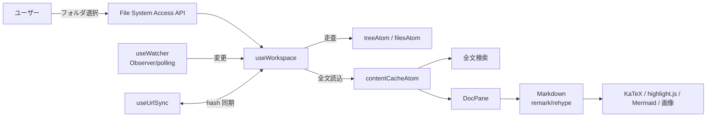

# ✨ mdglow

ブラウザだけで動く、ローカル Markdown フォルダのビューア。
サーバ不要（File System Access API）で、数式・コード・図・全文検索・リアルタイム反映に対応します。

---

## 特徴

- **サーバ不要** — ブラウザから直接ローカルフォルダを開く。ファイルは端末外に出ない
- **リアルタイム反映** — `FileSystemObserver`（Chrome 129+）でネイティブ監視。非対応時はポーリング
- **リッチな描画** — GFM / 数式(KaTeX) / コードハイライト / Mermaid 図 / 相対画像・相対リンク解決 / フロントマター
- **エディタ機能** — ファイルツリー、全文検索(`⌘⇧F`)、クイックオープン(`⌘P`)、目次スクロールスパイ、右クリックメニュー(相対/絶対パスのコピー・横に開く等)
- **画面分割** — 最大 4 ペイン、**左右・上下**両対応。ドラッグでサイズ調整、**ファイルツリーからの D&D** でペインへ配置・分割
- **複数フォルダ登録** — 開いたフォルダを履歴保持し素早く切替。ツリー開閉状態も永続化
- **URL 同期** — 開いているフォルダ/ファイルを URL に反映。リロード復元・ブラウザバック対応
- **12 テーマ / 6 書体** — 配色・書体・本文幅を切替
- **PWA** — インストールでオフライン起動＋ファイルアクセス許可の永続化
- **UI 崩れ対策** — 固定グリッド。長い表・コード・数式は各領域内でスクロール（本体は横スクロールさせない）

## 動作要件

Chrome / Edge など **Chromium 系ブラウザ**（File System Access API 必須）。Firefox / Safari は未対応。
File System Access API は **https または localhost（セキュアコンテキスト）** でのみ動作します。

## 開発

```bash
npm install
npm run dev
```

表示 URL を Chromium 系で開き、「フォルダを開く」で Markdown フォルダを指定。まずは同梱の `sample/` で試せます。

## ショートカット

| 操作 | キー |
|------|------|
| クイックオープン | `⌘P` / `Ctrl+P` |
| 全文検索 | `⌘⇧F` / `Ctrl+Shift+F` |
| サイドバー切替 | `⌘B` / `Ctrl+B` |
| 右に分割 | `⌘\` / `Ctrl+\` |
| 閉じる | `Esc` |

---

## 設計

### アーキテクチャ概要

完全なクライアントサイド SPA。バックエンドを持たず、ローカルファイルの読み取りは File System Access API、
状態は Jotai の atom、描画は remark/rehype パイプラインで行う。



### 技術スタック

| 領域 | 採用 |
|------|------|
| ビルド/フレームワーク | Vite 6 + React 18 + TypeScript |
| スタイル | Tailwind CSS v4（CSS 変数でテーマ）+ `@tailwindcss/typography` |
| 状態管理 | Jotai（`atomWithStorage` で永続化） |
| Markdown | react-markdown + remark-gfm/math/frontmatter + rehype-raw/slug/katex/highlight |
| 数式 / コード / 図 | KaTeX / highlight.js / Mermaid（遅延ロード） |
| アイコン | Material Symbols（バンドル・CDN 非依存） |
| 配信 | Cloudflare Workers Static Assets（Basic 認証ゲート） |

### 状態モデル（`src/state/atoms.ts`）

- `foldersAtom` / `activeFolderIdAtom` — 登録フォルダ（履歴）と選択中フォルダ
- `treeAtom` / `filesAtom` — ディレクトリツリーと平坦化ファイル一覧
- `contentCacheAtom` — 全 md の生テキスト（ペイン表示と全文検索で共有）
- `panesAtom` / `activePaneIdAtom` / `splitSizesAtom` — N ペイン分割の状態と幅比率
- `themeAtom` / `fontAtom` / `readingWidthAtom` / `expandedByFolderAtom` — 永続化される表示設定
- `highlightAtom` — 検索ヒットの本文ハイライト

### 主要な設計判断

- **リアルタイム監視**: `FileSystemObserver` を第一候補にし、未対応環境は開いているファイルの `lastModified` ポーリング＋定期ツリー再走査でフォールバック（`useWatcher`）。
- **描画の安定化**: `Markdown` を `body` でメモ化し、スクロール等の親再レンダーで再パースしない。これにより画像 blob の revoke や Mermaid の再描画チラつきを防止。
- **画像の解決**: 相対パス画像はローカル FS から読み出して object URL 化し、**セッション内キャッシュして revoke しない**（`lib/assetCache.ts`）。再マウント時も同期復元。
- **Mermaid**: 実フォントで初期化し測定失敗による巨大 SVG を回避。`suppressErrorRendering` で編集途中の不正図によるエラーグラフィック注入を抑止し、測定用一時ノードを毎回クリーンアップ。
- **UI 崩れ防止**: レイアウトは CSS Grid/Flex 固定。表はセル改行させず幅超過時はテーブルごと横スクロール（スクロールバー非表示）、コード/数式/図もそれぞれ内部スクロール。
- **URL 同期**: `hash` に `folder`/`file` を反映。権限が既に許可済みのときのみ無確認で復元し、未許可時はスタート画面へフォールバック（`useUrlSync`）。

### ディレクトリ構成

```
src/
  state/atoms.ts        # Jotai atom 定義（唯一の状態ソース）
  lib/                  # 純ロジック（FS 走査・検索・テーマ・フォント・URL・DnD・資産キャッシュ）
  hooks/                # useWorkspace / useWatcher / useUrlSync / useHotkeys / useInstallPrompt / useSearchHighlight
  components/           # UI（Toolbar/Sidebar/FileTree/PaneGroup/DocPane/Markdown/… ）
worker/index.ts         # Cloudflare Workers: Basic 認証ゲート → 静的アセット配信
```

---

## 運用（デプロイ）

静的アプリのため任意の静的ホストに置けるが、ここでは **Cloudflare Workers に Basic 認証付き**で配信する。

### 構成

`wrangler.jsonc` で `assets`（`dist`）を配信しつつ `run_worker_first: true` で全リクエストを
`worker/index.ts` に通し、Basic 認証を通過したものだけアセットを返す。認証情報は Workers Secrets に保存する。

### 初回デプロイ

```bash
# 1. Cloudflare にログイン（初回のみ・対話）
npx wrangler login

# 2. Basic 認証のユーザー名/パスワードを Secret として登録（値は対話入力）
npx wrangler secret put BASIC_AUTH_USER
npx wrangler secret put BASIC_AUTH_PASS

# 3. ビルドしてデプロイ
npm run deploy        # = npm run build && wrangler deploy
```

- ローカル確認は `npm run cf:dev`（`wrangler dev`）。Secret を使う場合は `.dev.vars` に `BASIC_AUTH_USER` / `BASIC_AUTH_PASS` を記載（コミット禁止）。
- 認証情報が未設定のときは Worker は素通し（認証なし）で配信する。

### 更新・ロールバック

```bash
npm run deploy                 # 再デプロイ
npx wrangler versions list     # バージョン一覧
npx wrangler rollback          # 直前へロールバック
```

### PWA と権限の永続化

- 配信 URL（HTTPS）を開き、ブラウザの「インストール」または起動画面の導線からインストールできる。
- **インストール済み PWA では、一度許可したフォルダの File System Access 権限が永続化**され、次回起動時にプロンプトなしで復元される（Chrome 122+ の persistent permissions）。起動時に `navigator.storage.persist()` を呼びストレージ eviction も抑止している。

### セキュリティ / プライバシー

- Markdown の読み取りは**すべてブラウザ内**で完結し、サーバに送信されない（Cloudflare には静的アセットのみ）。
- Basic 認証は Worker 側で定数時間比較。認証情報は Secrets に保存しコードや設定に埋め込まない。

---

## 既知の制約

- **許可ダイアログは自作不可**: `showDirectoryPicker` / `requestPermission` はブラウザのネイティブ UI で、Web から差し替え・抑制できない。セッション跨ぎの再プロンプト回避は PWA インストールが唯一の実効策。
- **絶対パスは OS パスではない**: File System Access API は OS の絶対パスを開示しない。「絶対パスをコピー」はワークスペースのルートフォルダ名を基点にしたパス（`ルート名/相対パス`）。
- **画面分割は URL 非対象**: 復元されるのはアクティブファイルのみ（分割レイアウトは要検討）。
- **Firefox / Safari 非対応**: File System Access API 未対応のため。

## 技術スタック（依存）

Vite・React・TypeScript / Tailwind CSS v4 / Jotai / react-markdown（remark・rehype）/ KaTeX / highlight.js / Mermaid / material-symbols / idb-keyval / js-yaml / wrangler
