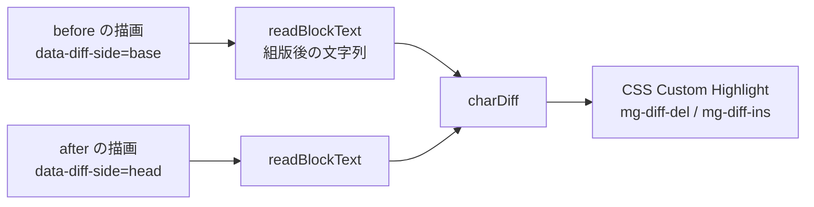

# コメント画面の差分表示

作成日: 2026-09-12 / 作成者: 汲田 晶

## 目的

指摘の箇所が**どう書き変わったか**を、文字単位で読めるようにする。

現状は「コメントした時点の本文」と「現在の本文」を並べて出すところまでで、
どこが変わったのかを比べる仕事は読み手に残っている。消えた語も、入った語も、
自分の目で探すことになる。

## 決まっていること

- 既定は**組版差分**。`editorial` の ON / OFF を反映する
- **ソース差分へ切り替えられる**
- 長すぎて突き合わせを諦めた塊は、**塊ごと置き換わったもの**として出す

## 現状

レビュー画面は差分を一切持たない。

- `Quote.tsx` — 指摘時のブロックを描画。選択箇所にハイライトは付くが、変更の印は無い
- `DocumentView.tsx` — 現在の文書を描画。書き換え時は `anchor.before` を
  「コメントした時点」として上に並べる
- 削除時は `Gone` が「ここに在った」として元の本文を出す
- 状態は文言でしか伝わらない

`DocumentView.tsx` の冒頭に、全文の版差分をやめた経緯が残っている。

> 版どうしの差分をまるごと並べていた頃は、指摘と関係のない書き換えが延々と
> 続いて何を見ればいいのか分からなかった

判断は正しい。ただし差分そのものまで捨ててしまった。**今回はスコープを
「指摘されたブロックの前後」に限るので、当時の問題は起きない。**

## 再利用するもの

差分の実装はすべてバージョン画面に揃っており、レビュー画面が使っていないだけ。

- `lib/charDiff.ts` — コードポイント単位の文字差分。日本語に効くよう単語区切りに
  依存しない。1,200 字で諦めて `gaveUp` を返す
- `lib/lineDiff.ts` — 行差分。`lineDiff(a, b)` が 2 つの文字列を直接取る。
  hunk・変更行の対応付け・変わらない行の畳み込みを持つ
- `components/version/SourceDiff.tsx` — ソース行差分の表示。統合 / 分割の両方
- `components/version/VersionDiff.tsx` の `useInnerMarks` — 文字印の適用

**新しい差分アルゴリズムは書かない。**

## 設計

### 印の付け方は DOM 駆動

`useInnerMarks` は `.mg-ver-pair` 配下の `[data-diff-side="base"]` と
`[data-diff-side="head"]` を DOM から拾い、描画後の文字列に `charDiff` をかけて
CSS Custom Highlight を張る。**データではなく DOM を見る**ので、同じ目印さえ
出せば他の画面でもそのまま効く。

### 現在ブロックの DOM を壊さない

ここが実装の勘所になる。

現在のブロックを描く要素には `data-mg-block` が付いており、**本文を選んで
コメントを作る仕組みがここに乗っている**（`DocumentView.tsx` のコメントに
「本文の画面と同じ名前で持つので、コメントを書く仕組みがそのまま乗る」とある）。
差分表示のために包み直すと、この経路が切れる。

そこで **DOM 構造を変えず、属性を足すだけ**にする。既存の要素へ
`data-diff-side="head"` を追加し、新設するのは before 側だけ。

### 差し込み位置

`DocumentView.tsx` の 2 か所は既に隣り合っている。

- `mg-before`（「コメントした時点」）— `anchor.before` を描画
- 現在のブロック — `block.src` を描画

この 2 つを `.mg-ver-pair` で包み、それぞれに `data-diff-side` を付ける。

### 状態ごとの見せ方

- **unchanged** — 差分を出さない。比べるものが無い。現状のまま
- **rewritten** — before / after のペアで差分を出す。本命の経路
- **removed** — after が無い。全体を削除として出す（`Gone` に印を足す）
- **unknown** — 候補の提示のみ。差分は出さない

### 切り替え

組版 / ソース と、統合 / 分割の 2 つ。ラベルはバージョン画面に揃える
（「ソース」「統合」「分割」）。

バージョン画面は `useState` で持っているが、レビュー画面は開閉を繰り返すので
`atomWithStorage` で覚える。毎回選び直させない。

### 諦めたときの見せ方

`charDiff` は 1,200 字を超えると `gaveUp` を返し、既存実装は印を付けずに飛ばす。
印が出ないままだと「変わっていない」と誤読されるので、**注記を出す**。

そのために `useInnerMarks` に戻り値を足し、諦めたペアを呼び出し側へ伝える。

## 実装手順

### 1. 文字印の適用を共有部品にする

`VersionDiff.tsx` の `useInnerMarks` を独立させ、レビュー画面からも呼べるようにする。
あわせて、諦めたペアを返す戻り値を足す。

`VersionDiff.tsx` の挙動が変わらないことを、バージョン画面で確かめる。

### 2. 差分ペインの部品を作る

`components/review/AnchorDiff.tsx` を新設する。受け取るのは before と after
（削除時は after 無し）、`editorial`、レイアウト、組版かソースか。

- 組版 — before / after を `.mg-ver-pair` と `data-diff-side` で包んで `Markdown`
  で描き、共有フックで印を張る
- ソース — `lineDiff(before, after)` の結果を `SourceDiff` に渡す

### 3. DocumentView に差し込む

`mg-before` と現在ブロックを `.mg-ver-pair` で包み、現在ブロック側には
`data-diff-side="head"` を**足すだけ**にする。`data-mg-block` と既存の class を
そのまま残すことを、コメント作成の操作で確かめる。

### 4. 削除された場合

`Gone` を差分の構えに寄せる。組版では before 全体を削除として印を付け、
ソースでは `lineDiff(before, "")` を渡す。

### 5. 切り替え UI と状態

`atomWithStorage` を 2 つ足し、切り替えを置く。置き場所は未決（後述）。

### 6. 諦めたときの注記

手順 1 の戻り値を使い、「この塊ごと置き換わりました」を出す。

## 性能

- 差分をかけるのは**指摘のブロック 1 つ分だけ**。文書全体には広げない。
  かつて全文差分をやめた理由がここに戻ってこないようにする
- `charDiff` の 1,200 字上限がそのまま安全弁になる
- `DocumentView` は本文を漸進的に描いている。印は DOM を読んでから張るので、
  対象ブロックが描かれたあとに走らせる。依存配列の取り方は `useInnerMarks` の
  既存の形に倣う

## テスト

CSS Custom Highlight は jsdom に無い。既存実装は `"highlights" in CSS` で守って
おり、テスト環境では印が張られずに抜ける。**印そのものは検証できない。**

検証するのは次の 3 つ。

- `charDiff` / `lineDiff` の出力 — 既にテストがある
- ペアの目印（`.mg-ver-pair` と `data-diff-side`）が DOM に出ること
- 状態ごとに正しい構えになること。rewritten でペアが出る、removed で全削除に
  なる、unchanged では差分が出ない

`data-mg-block` が残っていることも、この層で確かめる。ここが消えると
コメント作成が壊れる。

## 未決事項

- **切り替え UI の置き場所** — 指摘カードのヘッダか、差分ペインの上か。
  画面を見ながら決める
- **分割表示が幅に収まるか** — レビュー画面のサイドパネルは本文より狭い。
  収まらないなら、レビュー画面は統合のみにする判断もある
- **印の名前** — `mg-diff-del` / `mg-diff-ins` をバージョン画面と共有するか、
  分けるか。CSS Custom Highlight のレジストリはグローバルなので、両画面が
  同時に出ないことを確かめたうえで決める
