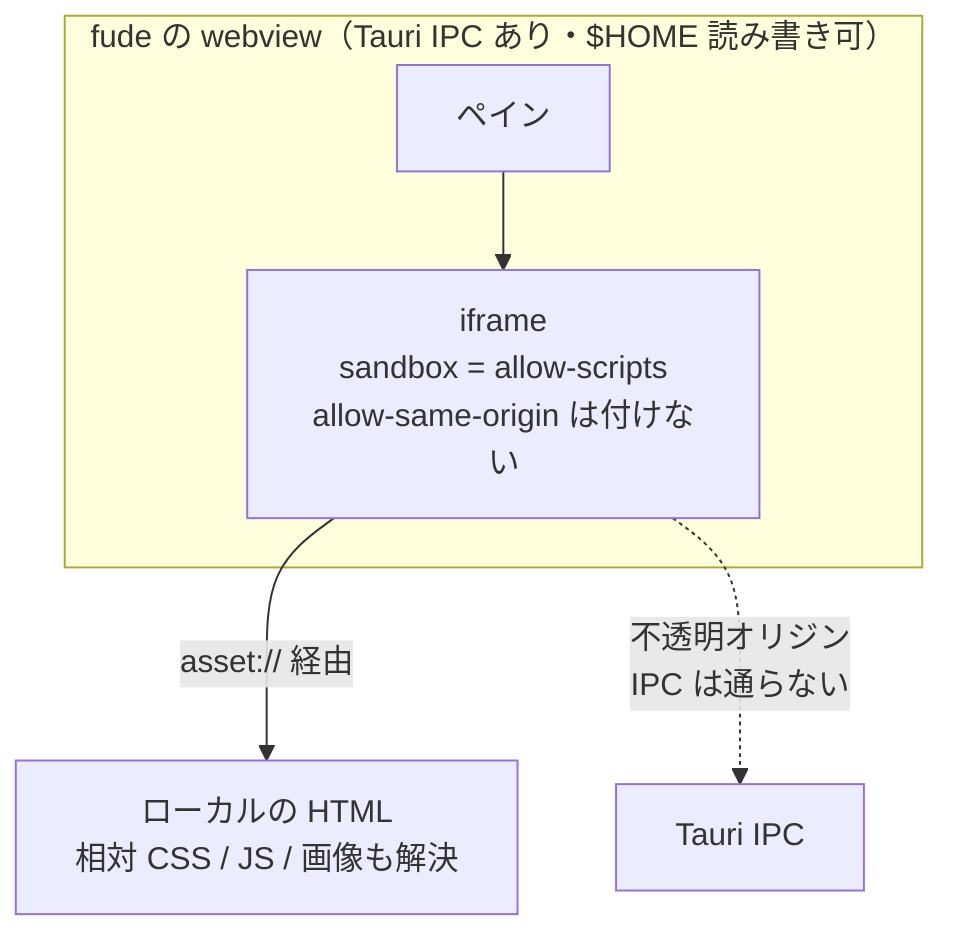

# ビューワーの拡張（画像・HTML）

作成日: 2026-09-12 / 作成者: 汲田 晶

## 目的

fude が開けるものを Markdown だけから広げる。画像ファイルをそのまま表示し、
HTML ファイルを軽量なビューワーとして描く。JS も動く。

**どちらも読む専用。編集はしない。レビューの対象にもしない。**

## 現状

- ツリーは Markdown だけを載せる（`fsAccess.ts` の `isMarkdown` で絞っている）
- 画像は「Markdown から参照される素材」としては既に解決できている。
  `isImage` / `IMG_MIME` / object URL のキャッシュ / `invalidateImage` による
  監視連動がある。**ファイルとして開く経路だけが無い**
- HTML は `htmlSpans.ts` が Markdown 中の囲みを扱うだけで、HTML ファイルを
  開く経路は無い

## 設計

### 開けるものを種別で分ける

- **Markdown** — 今までどおり。読む・書く・版・レビュー
- **画像** — 表示のみ
- **HTML** — 描画のみ

種別は拡張子で決める。`fsAccess.ts` に `fileKind()` を置き、ツリーの絞り込みと
開いたときの分岐を 1 か所に集める。判定が散らばると、対応する種別を増やすたびに
探し回ることになる。

### ツリー

絞り込みを「Markdown だけ」から「扱える種別すべて」に広げる。アイコンは種別ごとに
変える（今はすべて `markdown` を出している）。

### 画像ビュー

既存の解決経路をそのまま使う。`useWatcher` の `invalidateImage` が効いているので、
外で差し替えれば描き直る。操作はペイン内に収める・原寸・拡大縮小の範囲にとどめる。

### HTML ビュー

ここが本設計の中心になる。

#### 素の描画はしない

fude の webview は Tauri の IPC を持ち、capability で `$HOME/**` の読み書きと削除が
許可されている（`capabilities/default.json`）。さらに `tauri.conf.json` は
`csp: null` で CSP を張っていない。

**HTML の JS を本体と同じ文脈で走らせると、ファイルを 1 つ開いただけで $HOME を
自由にされる。** ここは利便性と引き換えにできない。

#### 隔離の形

- `<iframe sandbox="allow-scripts">` に閉じる。**`allow-same-origin` を同時に
  付けない。** 両方付けると sandbox は実質無効になり、親へ手が届く
- 読み込みは `asset://` 経由にする。相対パスの CSS / JS / 画像がそのまま解決される。
  `srcdoc` に流し込むと相対参照が壊れる
- Tauri の capability は window ラベル（`main` / `doc-*`）で効く。不透明オリジンの
  iframe はアプリのオリジンではないので IPC は通らない。ただし**設計として頼るのは
  sandbox 属性のほうで、capability は二重の守り**と位置づける

#### CSP を張るのは前提条件

ローカルの HTML が外部へ通信することがある。`csp: null` のままだと止める手段が無い。
**`csp: null` をやめることを、この機能の前提条件として扱う。** 機能を入れてから
考えることにはしない。

### 開き方

Markdown と同じくタブ／ペインに載せる。版もレビューも持たないので、ヘッダの
操作は出さない。

## 決めること

- **HTML の外部通信を許すか塞ぐか。** 許すなら「この文書は外部へ通信します」と
  分かる表示が要る
- 画像ビューの操作の範囲。拡大縮小と原寸だけで足りるか
- 扱えない種別を開いたときの振る舞い。何もしないか、OS に渡すか

## やらないこと

- 画像・HTML の編集
- 画像・HTML をレビューの対象にすること
- 画像・HTML の版の記録
