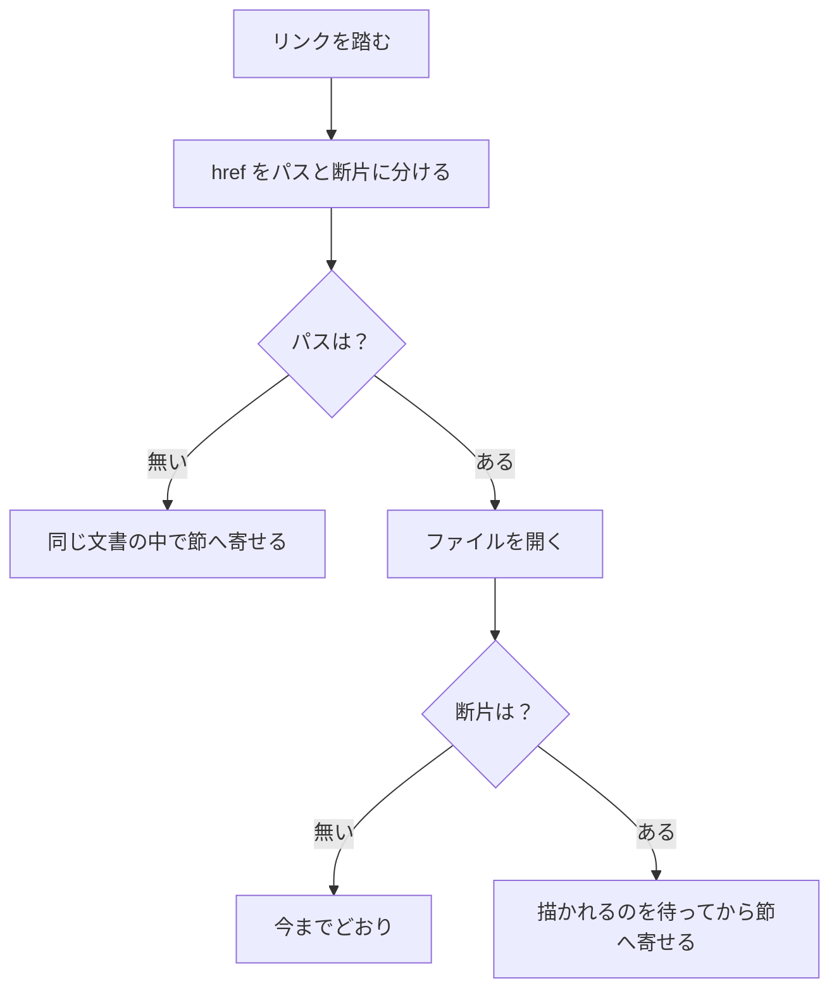

# ページ内リンク

作成日: 2026-09-12 / 作成者: 汲田 晶

## 目的

3 つの移動を通す。

- 同じ文書の別の節へ飛ぶ — `[文字](#見出し)`
- 別のファイルの節へ飛ぶ — `[文字](./05_要件定義書.md#ログ管理)`
- **AI に場所を指させる** — 返信や CLI の出力にリンクを載せ、人がクリックして飛ぶ

## 現状

見出しの id は既にある。`Markdown.tsx` が `rehypeSlug` を通しており、
GitHub 互換のスラッグが振られている。**足りないのは移動のほうだけ。**

- `#` で始まるリンクは素の `<a href="#...">` として出しているだけで、ハンドラが無い。
  本文のスクロールを持つのはペインのスクローラなので、ブラウザ既定の挙動では
  狙った位置に寄らない
- 他ファイルへの相対リンクは `onNavigate` → `navigate()` で開ける。ただし
  **`#` の断片を落としていない**。`./05_要件定義書.md#ログ管理` は断片ごと
  パスとして解決され、どのファイルにも一致せず**黙って何も起きない**
  （`useWorkspace.ts` の `navigate`）
- 目次は id ではなく要素の ref で `scrollIntoView` している

## 設計

### 解決器を 1 つにまとめる

`href` を「パス」と「断片」に分け、3 通りを同じ入口で捌く。

### 同じ文書の中を飛ぶ

素の `<a>` をやめ、ハンドラで受ける。スクロールの持ち主はペインなので、
id で引いた要素をペイン内で寄せる。目次の扱いに揃える。

**着地を一時的に目立たせる。** 飛んだ先が画面のどこにあるか分からないと、
読み手は結局そこから探すことになる。

### 他ファイルの節へ飛ぶ

`navigate()` が断片を落としていないのが原因。パスだけで解決し、開いたあとに
断片を当てる。

**本文は漸進的に描かれるので、開いた直後は目的の見出しがまだ DOM に無い。**
描かれるのを待ってから寄せる必要がある。レビュー画面が対象ブロックへ寄せるときと
同じ事情なので、同じ待ち方に揃える。

### AI に場所を指させる

ここが一番の肝になる。**AI がリンクを組み立てられるかどうかは、スラッグの規則が
予測できるかにかかっている。**

道は 2 つある。

- **規則を公開して AI に組ませる** — `rehypeSlug` は GitHub 互換なので、見出しの
  文字から機械的に決まる。ただし**同じ見出しが複数あるときの連番**（`-1`, `-2`）は
  文書全体を見ないと決まらず、AI は当てられない
- **fude が教える** — 指摘ごとのアンカーを CLI の出力に添える。`section_path` は
  既に台帳にあるので、そこからスラッグを作って出せる。AI は組み立てず、
  渡されたものを引き写すだけになる

**後者を採る。** 前者は重複見出しで外す。これは実データで裏付けた。requirements
配下 275 ファイル・見出し 5,688 件のうち **287 件（5.0%）に連番が付き、該当ファイルは
52 / 275（5 本に 1 本）**。1 ファイルで 34 件付くものもある。書き方の癖ではなく、
節名の再利用として普通に起きている。

出力に足すのは 1 行。位置解決の設計（[指摘の位置解決](./指摘の位置解決.md)）で
行番号を出すことにしているので、そこに並べる。

### コメントの中のリンク

コメント本文は `CommentMarkdown` が同じ `Markdown` を通して描くので、リンクの
ハンドラはそのまま効く。ただし**相対パスの基準はコメントではなく、指摘が付いている
ファイル**になる。基準をどこから渡すかを、実装時に間違えないようにする。

### 記法は標準のまま

`fude://` のようなスキームは導入しない。標準の `[文字](#見出し)` と
`[文字](./file.md#見出し)` のままにする。これは CommonMark のインラインリンク
そのもので、記法の逸脱は無い。

**GitHub でそのまま機能することは確認済み。** `rehype-slug` 6.0.0 は内部で
`github-slugger` 2.0.0 を使っており、これは GitHub の算法を再現するために
作られたライブラリそのもの。実際の要件定義書 37 見出しで生成したところ、
36 件は**見出しの文字がそのままスラッグ**になった（日本語は空白も ASCII 記号も
含まないため変換が起きない）。変換が起きた 1 件は次のとおりで、小文字化・
空白のハイフン化・全角括弧の除去という GitHub と同じ規則で動いている。

    `BillingNotificationSetting` テーブル（変更）
      → billingnotificationsetting-テーブル変更

バッククォートは、生ソースから作っても描画後のテキストから作っても同じ結果に
なることを確認した（fude は描画後から作る）。

**確認したのは GitHub のみ。** Obsidian は見出しリンクをスラッグではなく見出しの
文字で解決するため、変換が起きたスラッグは効かない可能性がある。日本語だけの
見出しは両方で通るが、そこに依存した書き方を勧めることはしない。

## 決めること

- 重複見出しの連番を fude 側で持つか、`rehypeSlug` の既定に従うか
- 着地の強調をどれくらい出すか
- 存在しないアンカーへ飛ばされたときの振る舞い。何もしないか、注記を出すか

## やらないこと

- 指摘そのものを指す URL（`fude://thread/...`）。今回の用途には要らない
