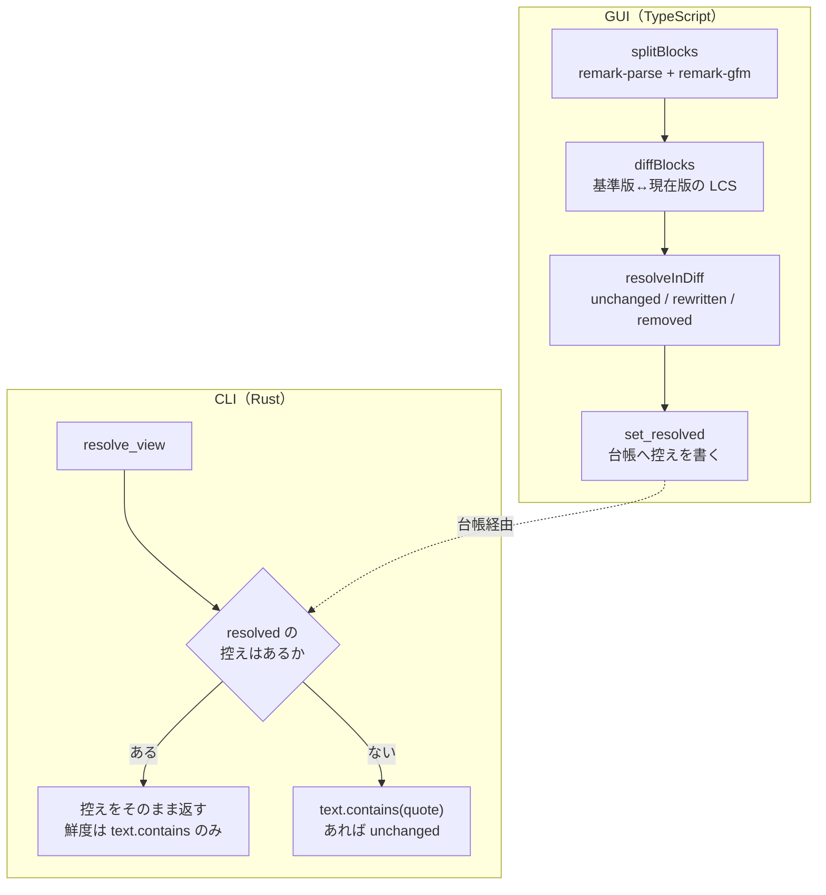
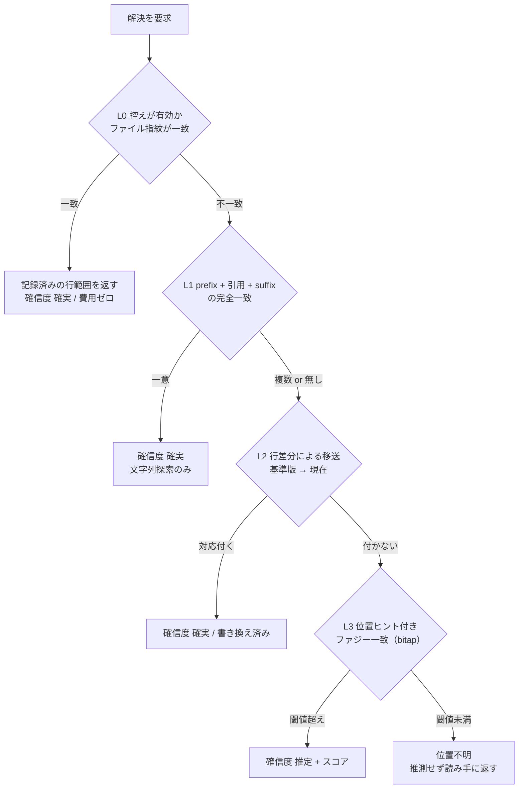

# 指摘の位置解決

作成日: 2026-09-12 / 作成者: 汲田 晶

## 背景

CLI から指摘を読んで直す使い方で、「この指摘はどこに対するものか」を読み手が
再導出する費用が大きい。実レビュー 1 区間（返信 16 件）の操作を数えた。

- ツール呼び出し 366 回のうち、位置探索（grep・出現数カウント）が 175 回、
  ファイルの読み直しが 51 回。**合計 226 回 = 62%**
- `fude review list` の再実行が 68 回。返信 16 件に対して 4 倍
- `--help` の往復が全セッション合計 36 回

直している時間より、直す場所を探している時間のほうが長い。

## 現状の構造

位置の対応付けは 2 つの実装がある。



GUI 側は版のスナップショットを保存し、版間のブロック差分で指摘の居場所を運ぶ。
`blockDiff.ts` はこの判断を明示している。

> 現在位置は探すのではなく、基準版のブロック → 対応付け → 現在のブロックと辿って
> 導出する。現在の本文から引用文字列を探す方法は、指摘に応えて本文が
> 書き換えられた瞬間に失敗する（この機能がいちばん働くべき場面で位置を失う）

判断は正しく、コードレビューツールのコメント移送（Gerrit の comment porting、
Review Board の interdiff）と同じ考え方になっている。問題は、**CLI がこの仕組みを
持たず、自分で否定したはずの引用探索に落ちていること**。

ここから 3 つの症状が出る。

- 位置は読み手が grep で再導出するしかない。出力の `場所:` は見出しパンくずで、
  節が長いと絞り切れない
- 引用の一意性が保証されない。同じ文が複数あっても `対象は書き換わっていない` と出る
- 1 件直すと控えが古くなり、次の list が `Rewritten` / `Unknown` に落ちる。
  68 回の再 list はこれ

## 現状の実測値

性能と容量の出発点を測った。

- CLI `review list --status all --brief` の所要 **10〜20ms**
- 台帳 `store.json` **410KB**（指摘 149 件 / 版 89 件 / 対象 15 ファイル）
- 台帳の内訳は指摘が 90%。うち `comments` 124KB、`quote` 54KB、`resolved` 41KB、
  `file`（絶対パスの重複）23KB
- スナップショット **4.6MB / 98 ファイル**（gzip・内容アドレスで重複は自動で畳まれる）
- 対象ファイルの実体は合計 822KB。最多のファイルに指摘 49 件、版 35 件
- 指摘の `quote` は平均 153 文字・中央値 84 文字・最大 1,526 文字

## 目標と非目標

### 目標

- CLI 単体で位置を解決し、**行範囲と確信度**を返す。GUI の起動有無に依存しない
- 同一文が複数ある場合の曖昧性を、推測ではなく根拠で解消する
- 解決できないことを隠さず、確信度として出す
- `review list` 全件の所要を **50ms 以内**に収める（現状 10〜20ms からの劣化を抑える）

### 非目標

- fude を書き込みの入り口にすること。ブロック単位の CRUD API は作らない。
  実レビューの編集 65 本を調べると、文書全体の用語統一（1 スクリプトで 7 連続置換）、
  見出し階層の変更、節の移動、相対位置への挿入が主で、ブロック置換では表現できない。
  作れば生ファイル編集の抜け道が必ず併存し、経路が二重になる
- CRDT / OT 化。外部エディタと AI が生ファイルを直接書く前提では成立しない
- **Rust 側で Markdown を解析すること。** 次節の制約により不要であり、解析器を
  2 つ持つことは本設計が最も避けたい事態にあたる

## 前提となる制約 — Rust は Markdown を解析しない

当初は `splitBlocks`（remark-parse + remark-gfm + HTML 囲みの前処理）を Rust へ
移植する前提で考えていた。remark と comrak の分割が一致する保証はなく、粒度がずれれば
GUI の控えと CLI の解析が食い違って位置が飛ぶ。**この危険は、移植をしないことで
取り除ける。**

CLI が呼ぶのは `list` / `counts` / `reply` / `resolve` / `reopen` / `commit` /
`checkpoint_file` / `sweep` / `versions` の 9 つで、**指摘を作る経路がない**。
`create_thread` は Tauri command であり GUI からしか呼ばれない。

つまり CLI の仕事は次のとおり分かれる。

- **構造を導出する** — 本文をブロックに割り、見出しの階層を求める。
  解析器が要る。**GUI だけが行う**
- **記録済みの居場所を今の本文の中から見つけ直す** — 記録された文字列を探す。
  解析器は要らない。**CLI が行う**

指摘を作るのは常に GUI なので、ブロック境界も `section_path` も作成時に確定し、
台帳に入る。CLI はそれを**探し直す**だけで、**割り直す**必要がない。

Gerrit のコメント移送が対象言語の構文解析を持たず、テキスト差分だけで動くのと同じ構図。
`blockDiff.ts` が行差分を退けた理由は「変更前と変更後をそれぞれ描画して並べる」ためで、
**表示の要求であって位置特定の要求ではない**。CLI は範囲が分かればよく、
読める差分を組み立てる必要がない。

### この制約を保つための決めごと

- **CLI に指摘の作成系を足さない。** 足すならこの前提が崩れるため、本設計から
  やり直す。`review` サブコマンドに `add` 系を追加する提案は、この節を根拠に退ける
- アンカーの正準表現を**ファイル内のバイト範囲**に統一する。GUI 側の `Block` は
  すでに `start` / `end` のオフセットを持っており、書き出しに追加の実装は要らない
- 範囲の生産者は GUI と CLI の 2 つになるが、両者が求めるのは同じ 1 つの量
  （この文字列は今どこにあるか）で、割り方の違いによる分岐が生じない

## 設計

### 多段フォールバック

W3C Web Annotation Data Model が採る「手掛かりを冗長に持ち、復元時に順に試す」
構成を採る。**段の順序は精巧さではなく費用で決める。** 安い段で決まるなら高い段を
走らせない。



L0 が通常パス。L1 は引用と前後の文脈がそのまま残っている場合で、単純な文字列探索
だけで確定する。ここまでで大半が決まり、**差分の計算は本当に書き換えられたものにしか
発生しない**。

L2 の行差分移送は、基準版と現在の本文を行単位で突き合わせ、記録された行範囲を
現在の行範囲へ写す。Gerrit の comment porting と同じ方式で、Markdown の知識を要しない。

L3 は Google diff-match-patch の `match_main(text, pattern, loc)` と同じ考え方で、
Bitap 法により「期待位置の近傍を優先した近似一致」を求める。Hypothes.is が
同じ二段構えを採っている。

閾値は編集面側の既存判断（`reviewAnchors.ts` の `ENOUGH = 0.62` / `MARGIN = 0.12`、
僅差では寄せない）を踏襲し、判断を 2 か所に分けない。

### 移送の精度を上げる方法

版の飛距離が縮むほど移送は正確になる。ただし編集のたびにスナップショットを打つと
容量が破綻する（1 セッション 65 編集 × 圧縮後 47KB ≒ 3MB）。

版を増やす代わりに、**CLI が解決するたびに控えを書き戻す**。基準が常に直近に
更新されるので、1 回の移送で跨ぐ編集が 1 回分に縮む。版は「人が意味のある区切りで
打つもの」という現在の役割のまま変えない。

### 指摘が持つ手掛かり

現状は `quote` / `block_hash` / `selection` / `selection_offset` / `section_path` /
`base_version`。ここに L1・L3 のための手掛かりと、L0 の高速パスのための控えを足す。

追加する手掛かり

- `prefix` — 引用の直前 96 文字
- `suffix` — 引用の直後 96 文字
- `char_start` — 指摘作成時点の、ファイル先頭からの文字オフセット

`resolved` の控えに足すもの

- `byte_start` / `byte_end` — 解決したバイト範囲。**アンカーの正準表現**
- `line_start` / `line_end` — 表示用に導いた行範囲
- `file_fingerprint` — 解決時点のファイルの内容ハッシュ
- `confidence` と `method` — どの段で解決したか

`head_quote`（現在の本文全文）は範囲を持てば保持が不要になり、41KB が縮む。

既存データは serde の default で空のまま読める。空のときは L1 を飛ばす。
GUI がファイルを開いたとき、および CLI が解決したときに遡って埋める。

### 出力

行範囲と確信度を、既存の短いラベル形式に足す。

```
#06728130  未対応  L124-128  確実        機能要件 › 通知内容の絞り込み
#8418a3d6  未対応  L130-134  推定 0.78   業務要件 › 業務フロー
#9cd261d1  未対応  位置不明               概要
```

同じ引用が複数ある場合は候補数を添え、どれか 1 つに決め打たない。

`--format json` には `byte_start` / `byte_end` / `line_start` / `line_end` /
`confidence` / `method` / `candidates` を出す。読み手が機械なら、ここから
そのまま編集対象を組み立てられる。

完璧な復元より、怪しいことを明示するほうが実務では効く。GitHub がコメントを
outdated と表示するのと同じ扱いにする。既存の `次:` 行はこの思想で書かれており、
位置にも同じ扱いを広げる。

## 性能設計

### 予算

- `review list` 全件（15 ファイル・822KB）で **50ms 以内**
- `--file` 指定で **30ms 以内**
- 現状 10〜20ms からの劣化を上記に収める

### 費用の内訳

段ごとに費用が大きく違うため、何がどの段で発生するかを分けて見る。

- 台帳の読み込みと解析 — 410KB → 500KB、serde_json で 2〜3ms。**常に発生**
- 対象ファイルの読み込み — 822KB で約 3ms。L0 が外れたファイルのみ
- L1 の文字列探索 — 822KB 全体を走査しても 1ms 未満
- L2 の行差分 — 基準版の展開（gzip 47KB → 165KB）に約 1ms、行差分に約 2ms。
  **書き換えられたファイルの数だけ**
- L3 の bitap — L1・L2 が外れた指摘の数だけ。局所探索なので 1 件 1ms 未満

通常の実行は「台帳 3ms + L0 命中」で終わり、現状とほぼ変わらない。
1 ファイルを直した直後でも「台帳 3ms + 読み込み 3ms + L1 1ms + L2 3ms」で 10ms 程度。

最悪ケース（15 ファイルすべてが書き換わり、すべて L2 まで落ちる）で
3 + 3 + 1 + 15 × 3 = 52ms。予算の境界に触れるが、これは全ファイルを同時に
書き換えた直後にしか起きない。

### 費用を払わない仕組み

1. **L0 の高速パス** — 控えの `file_fingerprint` と現在のファイルの (mtime, size)
   が一致すれば、読み込みも探索もしない。連続実行では大半がここで止まる
2. **費用順の段構成** — 差分計算は L1 が外れたものにしか発生しない
3. **ファイル単位のメモ化** — 1 回の実行で同じファイルを複数の指摘が参照する
   （最多のファイルは 49 件）。読み込みと差分は 1 ファイル 1 回に畳む
4. **絞り込みの尊重** — `--file` / `--project` 指定時は対象ファイルだけ扱う

### 退行の検知

段階別の所要を出す `--timing` を隠しフラグで持ち、`review list` 全件の所要を
ベンチとして CI で測る。予算を超えたら落とす。

## 台帳の保存形式

### 現状の評価

単一の `store.json` を毎回全読み・全書きしている。410KB の読み込みは 2〜3ms で
問題にならない。書き込みは返信 1 回ごとに全体を書き直すが、`write_atomic`
（tmp へ書いて rename）で安全性は取れており、この規模では体感に出ない。

手掛かりの追加で 149 件あたり約 86KB 増え、**500KB 前後**になる見込み。
指摘が年 3 倍に増えても 1.5MB 程度で、JSON のままで成立する。

### DB へ移す判断

**`store.json` が 5MB を超える、または指摘が 1,000 件を超えたら SQLite へ移す。**
それまでは移さない。単一ファイルで完結することは、内容アドレスのスナップショットや
GUI 非起動でも動く CLI と同じ利点の側にある。

移す場合は指摘 / 会話 / 版 / アンカーの 4 テーブルに割り、ファイルパスに索引を張る。
`format_version` で旧形式を判別し、片方向に変換する。

### 移す前に効く軽い改善

- `file` の絶対パスが 23KB（全体の 6%）重複している。ファイル表に正規化して
  ID 参照にする
- `comments` が 124KB（34%）で最大。解決済みの指摘の会話を別ファイルへ退避し、
  list の常用パスから外す
- `resolved.head_quote` 41KB は、範囲を持てば全文の保持が不要になる

3 つで台帳は 3 割前後縮む。手掛かりの追加分を吸収できる。

## スナップショットと gc

現状 4.6MB / 98 ファイル。gzip かつ内容アドレスなので、同じ内容は自動で 1 つに畳まれる。
自動 checkpoint を採らない判断により、成長は現在のペースのまま。

既存の `review gc` に 2 つ足す。

- どの指摘からも参照されていない版を捨てる
- 同一ファイルの連続する版を間引く（直近 N 本と、日単位で 1 本を残す）

## 実装の段階

各段階は単体でリリースでき、前の段階の成果を壊さない。

### 第 1 段階 — 行番号と一意性の出力

引用の出現位置をファイル全体から走査し、行範囲と出現回数を出す。出力と JSON スキーマの
形をここで確定させる。文字列探索だけなので性能への影響はほぼ無く、grep の大半が
これだけで消える。**費用対効果が最も高い。**

### 第 2 段階 — 控えの書き戻しと高速パス

CLI が解決するたびに `resolved` へバイト範囲と `file_fingerprint` を書き戻す。
GUI 側も `Block` の `start` / `end` から同じ形で書き出すよう揃える。
L0 の高速パスが効き始め、移送の飛距離も縮む。

### 第 3 段階 — prefix / suffix による確定（L1）

手掛かりの追加と遡り埋め。同一文が複数ある場合の曖昧性がここで解ける。

### 第 4 段階 — 行差分による移送（L2）と bitap（L3）

`similar` による行差分と、位置ヒント付きの近似一致。確信度の出力。

### 第 5 段階 — gc の強化と台帳の軽量化

## 検証

- **正準表現の一致** — 同じファイル・同じ指摘に対して、GUI が書いた範囲と CLI が
  解いた範囲が一致することを確かめる。両者が別々に構造を割ることはないため、
  食い違うとすれば範囲の表現（改行の含み方、UTF-8 の境界）に限られる。
  ここを往復テストで縛る
- **段の分布** — 実台帳の 149 件に対し、L0〜L4 のどの段で解決したかの分布を出す
  回帰スクリプトを置く。段階を進めるごとに位置不明が減ることを数で確認する
- **性能** — `review list` 全件の所要を CI で測り、予算 50ms を超えたら落とす

## 方式の実測による裏付け

設計を書いたあと、実台帳 149 件に対して方式を試作し、GUI が解いた結果を正解として
突き合わせた。**Markdown を解析せず、行差分の移送だけでどこまで届くか**を確かめるため。

### GUI 側の到達点（解析器つき）

台帳の控えの内訳は unchanged 37 / rewritten 45 / removed 41 / unknown 3 / 控えなし 23。
本文が今も存在するものが 82 件、削除されたものが 41 件で、**本当に分からないのは 3 件**。
removed は算法の失敗ではなく、対象が消えたという正しい答えにあたる。

### 解析器なしの移送を試した結果

基準版のスナップショットから引用の行範囲を取り、行差分で現在の行範囲へ写した。
正解は GUI が控えた現在の本文の位置とする。

- 行範囲が完全一致 47 件
- 行範囲が重なる（端のずれ）5 件
- 2 行以内の近傍 1 件
- 別の場所を指した 1 件
- 正解が定まらず判定できない 28 件（GUI の控え自体が古く、現ファイルに無い）

**判定できた 54 件のうち 53 件（98.1%）が正しい場所に着地した。**

判定できなかった 28 件は、GUI の控えが古いまま放置されていたもの。控えを解決のたびに
書き戻す設計（第 2 段階）は、この状態そのものを無くす。

### 読み取れること

- 行差分の移送は、解析器なしでも GUI と同じ場所に届く。方式として成立している
- 外した 1 件（6 行のずれ）は、確信度を出さずに断定すると害になる種類の誤り。
  推定には必ずスコアを添えるという設計判断が要る
- 標本は 1 人・1 種類の文書（要件定義書）に偏っており、この数字をそのまま一般化しない。
  第 1 段階の回帰スクリプトで継続して測る
- 試作は Python の `difflib`（行単位の SequenceMatcher）で行った。実装に使う Rust の
  `similar` が厳密に同じ対応付けを出す保証はない。**98.1% は方式の見込みであって、
  実装の到達点ではない。** 第 4 段階の完了時に同じ回帰スクリプトで測り直す

## リスクと未決事項

- **範囲表現の境界** — 改行をブロックの末尾に含めるかどうか、UTF-8 の途中で
  範囲が切れないことの保証。往復テストで縛る。解析器の差と違い、決めれば決まる
- **遡り埋めの扱い** — 既存 149 件の `prefix` / `suffix` は、指摘した時点の本文が
  版として残っていれば正確に埋まる。残っていない指摘は空のままとし、L1 を飛ばす
- **移送がブロックをまたぐ場合** — 元のブロックの内部に空行が入って 2 ブロックに割れた
  とき、移送後の範囲は両方を覆う。レビューの用途では「指摘した対象が今はこの範囲」で
  正しく、あえて割り直さない
- **確信度の閾値** — `ENOUGH = 0.62` / `MARGIN = 0.12` を出発点とするが、
  実台帳の分布を見て調整する余地がある
