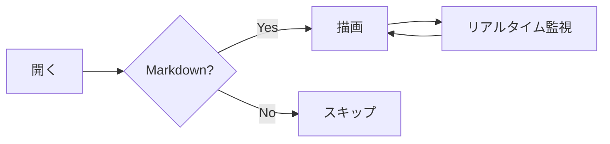

# mdglow デモ

このファイルは **mdglow** の表示機能を一通り確認するためのサンプルです。
このフォルダ（`sample/`）を「フォルダを開く」で指定すると、すぐに動作を試せます。

## 主な機能

- 📁 ファイルツリー（左サイドバー）
- 🔍 全文検索（`⌘⇧F`）とクイックオープン（`⌘P`）
- 🎨 テーマ切替（右上）
- ▥ 画面分割（`⌘\`）
- ⚡ ファイル変更のリアルタイム反映

> このファイルをエディタで編集して保存すると、画面が自動で更新されます。試してみてください。

## 数式（KaTeX）

インライン数式は $e^{i\pi} + 1 = 0$ のように書けます。ブロック数式:

$$
\int_{-\infty}^{\infty} e^{-x^2}\,dx = \sqrt{\pi}
$$

$$
\mathbf{A} = \begin{pmatrix} a & b \\ c & d \end{pmatrix}, \quad \det(\mathbf{A}) = ad - bc
$$

## コードブロック（シンタックスハイライト）

```typescript
interface User {
  id: number;
  name: string;
}

async function fetchUser(id: number): Promise<User> {
  const res = await fetch(`/api/users/${id}`);
  if (!res.ok) throw new Error("not found");
  return res.json();
}
```

```python
def fib(n: int) -> int:
    a, b = 0, 1
    for _ in range(n):
        a, b = b, a + b
    return a
```

## Mermaid 図



## 表

| 機能 | ショートカット | 説明 |
|------|--------------|------|
| クイックオープン | `⌘P` | ファイル名で検索して開く |
| 全文検索 | `⌘⇧F` | 全 md を横断検索 |
| サイドバー | `⌘B` | 表示 / 非表示 |
| 画面分割 | `⌘\` | 2 ペイン表示 |

## タスクリスト

- [x] Markdown の描画
- [x] 数式・コード・図
- [ ] あなたのメモを読む

## リンク

- [ガイド: 記法一覧](guide/syntax.md)
- [メモの例](notes/idea.md)
